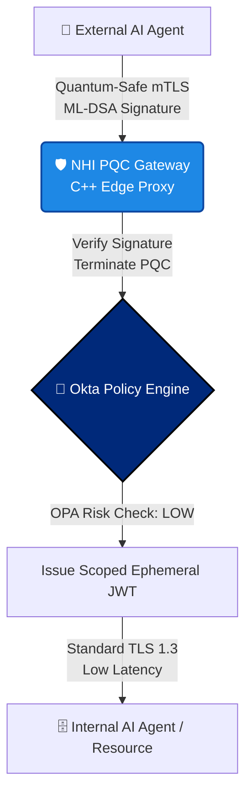

# 🛡️ nhi-pqc-gateway


-green.svg)


This framework is demoing and simulating real-life workflow and protocols ( in future releases ) with simplified implementation of key parts, like
simulating a real-life wrapper around the Open Quantum Safe (liboqs) C-library.


**High-performance, quantum-resistant proxy for high-velocity Non-Human Identity (NHI) and Agentic AI workloads.**

As enterprises transition to Post-Quantum Cryptography (PQC), traditional Identity Providers face a critical bottleneck: PQC signatures (like ML-DSA) are significantly larger than RSA/ECC. For autonomous AI agents executing thousands of micro-transactions per second, standard PQC handshakes introduce paralyzing latency. 

`nhi-pqc-gateway` is a C++ offload engine that handles quantum-safe cryptographic termination at the edge, ensuring secure Agent-to-Agent (A2A) federation without degrading LLM workflow speeds.

-----

## 🎯 Strategic Value (The PQC + AI Intersection)

Identity is moving from Human-to-Machine (H2M) to Machine-to-Machine (M2M) at an unprecedented scale. This gateway demonstrates the infrastructure required to secure the next decade of Okta's ecosystem:

* **Zero-Latency PQC Offload:** Terminates ML-KEM (Kyber) key exchanges and ML-DSA (Dilithium) signature verification in optimized C++, preventing the main Okta policy engine from being compute-bound.
* **Agentic Token Chaining:** Verifies quantum-signed JWTs (RFC 8693) to maintain cryptographic chain-of-custody when one AI model delegates a task to another.
* **Session Resumption for High-Frequency Loops:** Implements custom caching for AI agents communicating in tight recursive loops, minimizing the overhead of repeated PQC handshakes.

---


## 🏗️ Architecture: The PQC Edge Proxy

This gateway sits at the network edge, terminating the heavy ML-KEM/ML-DSA quantum cryptography so the internal API network and AI Agents can communicate using lightweight, optimized tokens.




## 🛠️ Technical Stack

* **Core Engine:** C++20 (Optimized memory arenas for handling large PQC keys)
* **Cryptography:** `OpenSSL 3.x` + `liboqs` (Open Quantum Safe provider)
* **Concurrency:** Asynchronous non-blocking I/O (`epoll` / `kqueue`)
* **Build System:** CMake

---

## 🚀 Quick Start (Simulation Mode)

*Note: This repository currently provides a simulation harness to benchmark the latency difference between Classical ECC and Post-Quantum algorithms for agentic token verification.*

### 1. Install Dependencies (Ubuntu/Debian)
Ensure you have the Open Quantum Safe library and modern CMake.
```bash
sudo apt-get update
sudo apt-get install cmake g++ libssl-dev
# Requires liboqs to be built and installed locally
```

### 2.Build the Gateway Benchmark

```Bash
git clone [https://github.com/abokov/nhi-pqc-gateway.git](https://github.com/abokov/nhi-pqc-gateway.git)
cd nhi-pqc-gateway
mkdir build && cd build
cmake ..
make
```

### 3. Run High-Velocity Agent Simulation
Simulate 10,000 recursive agent-to-agent token exchanges using ML-DSA-44 (Dilithium).

```Bash
./nhi-pqc-benchmark --algo ml-dsa-44 --iterations 10000 --payload-size 512
```


### 4. 📊 Sample Benchmark Output
The simulation highlights the compute overhead of PQC on high-velocity agent traffic, proving the necessity of an optimized edge gateway:

```text
🚀 Initializing NHI PQC Gateway Benchmark...
Target: 10,000 Agent-to-Agent Token Verifications

[CLASSICAL] ECDSA (P-256):
  Total Time: 12.4 ms
  Avg Latency per Verification: 0.0012 ms
  Status: SECURE (Vulnerable to Shor's Algorithm)

[QUANTUM-SAFE] ML-DSA-44 (Dilithium2):
  Total Time: 148.2 ms
  Avg Latency per Verification: 0.0148 ms
  Signature Size: 2420 bytes (Overhead warning for Agent JWTs)
  Status: SECURE (NIST FIPS 204)

[ARCHITECTURAL INSIGHT]: 
ML-DSA introduces a 10x compute latency and massive payload bloat. 
Recommendation: Enable gateway session resumption and stateful hash-based signatures (LMS/XMSS) for tight agentic loops.
```
